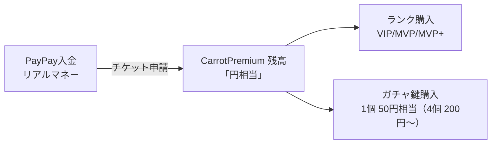

import { Callout } from 'fumadocs-ui/components/callout';
import { Card, Cards } from 'fumadocs-ui/components/card';
import { Tab, Tabs } from 'fumadocs-ui/components/tabs';
import { Step, Steps } from 'fumadocs-ui/components/steps';
import { Accordion, Accordions } from 'fumadocs-ui/components/accordion';
import { Crown, Star, Sparkles, Gift, Coins, ShoppingBag, Gem, Zap, Heart, Wallet, AlertTriangle, BadgeCheck, Video, MessageCircleHeart, Box, HeartHandshake, ShieldAlert } from 'lucide-react';

<Callout type="warn" title="🥕 寄付に関する大切なお願い" icon={<HeartHandshake />}>
  **CarrotCraft の寄付（VIP/MVP/MVP+ ランク購入）は、サーバーの維持・運営費にすべて充てられます。**

  - サーバー代・ドメイン代・各種サービス利用料に使われ、運営の利益にはしません
  - **絶対に無理しない範囲で**お願いします。日々の生活・学業を優先してください
  - **18歳未満の方は保護者の同意を必ず得てから**寄付してください
  - 一時の感情で大きな額を送らないでください。冷静にどうぞ
</Callout>

<Callout type="error" title="⚠️ 返金・トラブル防止のお願い" icon={<ShieldAlert />}>
  以下を **必ず読んで同意の上**で寄付してください。寄付後のクレームは原則お受けできません。

  - **PayPay の送金は返金できません**（PayPay の仕様上、運営側から取り消し不可）
  - **誤って多く送ってしまった場合も返金不可** — 残高は退会まで使い切ってください
  - **ランクの失効・サーバー閉鎖・プラグイン仕様変更**による補償もありません
  - **ガチャの結果**（出るアイテムの種類・レアリティ）への補償もありません
  - 自分以外の人の名義で寄付した場合、特典反映に時間がかかる/お断りする場合があります

  これらに同意いただけない方は、寄付をご遠慮ください。
</Callout>

<Callout type="info" title="このページの読み方">
  CarrotCraft には **寄付ランク 3 種類**（VIP / MVP / MVP+）があり、UltraCosmetics と連携した豊富なコスメティック特典が付きます。**ランクはサーバー間で同期**します。
  さらに **YouTube ショートで宣伝すると、再生数に応じて残高が無料で還元**されます（30再生=1円）。
</Callout>

---

## 🎖 ランク一覧

<Cards>
  <Card
    icon={<Star />}
    title="VIP（500円/月）"
    description="スタンダード。パーティクル5種＋ガチャ（パーティクル/死亡）。"
  />
  <Card
    icon={<Sparkles />}
    title="MVP（1,000円/月）"
    description="上位。優先キュー＋全カテゴリの初期所持＋全プールガチャ。"
  />
  <Card
    icon={<Crown />}
    title="MVP+（3,000円/月）"
    description="最高峰。全コスメ即解放＋ピンクグラデーションのプレフィックス＋優先キュー。"
  />
</Cards>

---

## 🎁 各ランクの特典

<Tabs items={['VIP', 'MVP', 'MVP+']}>

<Tab value="VIP">
スタンダードな課金ランク。

| 項目 | 値 | 説明 |
|---|---|---|
| 月額 | 500円 | 30日間 |
| パーティクル初期所持 | 5 種 |  |
| ガチャプール | PARTICLE + DEATH |  |
| 入退室メッセージ | 選択可 | 一部プリセット |
| プレフィックス | VIP |  |
</Tab>

<Tab value="MVP">
VIP の全特典 + 上位機能。

| 項目 | 値 | 説明 |
|---|---|---|
| 月額 | 1,000円 | 30日間 |
| 優先キュー | 有効 | 混雑時に優先入場 |
| 初期所持 | PARTICLE 20 / PETS 12 / HATS 25 / PROJECTILE 12 / EMOTES 4 |  |
| ガチャプール | 全カテゴリ | ペット・帽子・入退室メッセージも引ける |
| プレフィックス | MVP（専用色） |  |
</Tab>

<Tab value="MVP+">
最高峰ランク。ガチャを引かなくても全コスメが使えます。

| 項目 | 値 | 説明 |
|---|---|---|
| 月額 | 3,000円 | 30日間 |
| コスメティック | 全アイテム使用可 | ガチャを引かなくても解放済み |
| ガチャ | 永久所有記録のために引ける | 期限切れ後の保険 |
| 優先キュー | 有効 |  |
| プレフィックス | MVP+（ピンクグラデーション） |  |
</Tab>

</Tabs>

---

## 💰 入金 & ゲーム内通貨

<Callout type="info" icon={<Wallet />}>
  **PayPay → CarrotPremium 残高 → ランク / ガチャ鍵** という 2 段構えです。残高に貯めたぶんを、ゲーム内でいつでもランクや鍵に充てられます。
</Callout>

- **PayPay は最初の 1 回だけ** — チケットを切って希望額をまとめて入金
- そこから先は **ゲーム内通貨（残高）** を消費してランクや鍵を買う
- `/cpremium rank` でいつでも残高・期限を確認できる

---

## 🎰 ガチャシステム

<Cards>
  <Card icon={<Box />} title="鍵価格" description="1個 50円相当（4個 200円〜 / 10個 500円のセット販売もあり）" />
  <Card icon={<Gift />} title="当たり" description="鍵1個につき 1つのコスメティック" />
  <Card icon={<BadgeCheck />} title="永久所有" description="当てたアイテムはサーバー間で永続記録、課金期限切れ後も所有自体は残る" />
  <Card icon={<Sparkles />} title="GUI" description="/uc menu から購入・引換が可能" />
</Cards>

メニュー内では、各アイテムに `<rank>特典` / `個人所有(ガチャ当たり)` の区別タグが表示されます。

<Callout type="warn" title="⚠️ ガチャに関する重要な注意" icon={<AlertTriangle />}>
  **最低でも VIP 以上を保有していないとガチャは引けません。**

  - 一般ランク（default）のままだとガチャ鍵を買っても**当たり対象が無く、何も出ません**
  - 引いたコスメは **永久所持・永久使用可能**。課金期限切れで一般ランクに戻っても、過去に引いたエフェクトはそのまま使えます

  **「とりあえずガチャだけ引きたい」は成立しません**。まず VIP 以上を取得してから鍵を買ってください。
</Callout>

---

## 🛒 取得方法

<Tabs items={['💴 寄付（PayPay）', '🎬 YouTube ショート宣伝（無料で残高 GET）']}>

<Tab value="💴 寄付（PayPay）">

<Steps>

<Step>
### Discord のサポートセンターでお問い合わせ
[CarrotCraft Discord](https://discord.gg/EKUPDxXaqb) の **サポートセンター** からお問い合わせください。**この時点ではランクを決める必要なし**、入金したい金額だけ伝えればOK。
</Step>

<Step>
### PayPay の「受け取りリンク」で運営に送金
**お手元の PayPay アプリで金額を指定したリンクを生成 → そのURLをチケットに貼る** のが一番カンタンです。送金額がそのまま残高になります（1円 = 1円相当）。

**送金手順（PayPay アプリ）**:
1. PayPay アプリのホーム画面 → 「**送る**」をタップ
2. 「**受け取りリンクを作成する**」を選択
3. 送金したい金額を入力（例: 500 円）
4. 「**○○円を送る**」をタップ → 受け取りリンク（URL）が生成される
5. 生成された URL をコピー → Discord のチケットに貼り付け

**金額の例**:
- 500円 → 残高 500円相当（VIP 1ヶ月ぶん）
- 3,000円 → 残高 3,000円相当（MVP+ 1ヶ月 or VIP 6ヶ月）
- 200円だけ送ってガチャ鍵 4個分だけチャージも可

> 💡 **受け取りリンクの有効期限は 4日（96時間）**。期限内に運営が受け取らなければ**自動的にあなたの残高に戻ります**（取られっぱなしになる心配なし）。
</Step>

<Step>
### 運営が手動で残高を反映
通常 24時間以内。チケットに完了通知が来ます。**この時点ではまだランクは付与されていません** — 残高がチャージされただけ。
</Step>

<Step>
### ゲーム内で好きなときにランクを購入
`/cpremium buy <vip|mvp|mvpplus>` または `/uc menu` のランクアイコンクリック → 確認ダイアログ。**残高から月額が引かれてランクが付与**されます。

> 💡 残高に貯めておけば、後で「やっぱりMVPにしよう」「来月はVIPだけ延長」など**自由に決められます**。
</Step>

</Steps>

<Callout type="info" icon={<ShoppingBag />}>
  **差額アップグレード対応**：VIP（500円）保有中に MVP（1,000円）に上げる場合、**差額500円のみ**請求されます。
</Callout>

<Callout type="warn">
  自動入金は順次対応予定。**当面はチケット経由の手動入金**です。
</Callout>

</Tab>

<Tab value="🎬 YouTube ショート宣伝（無料で残高 GET）">

YouTube ショートで CarrotCraft を宣伝してくれた方には、**再生数に応じて残高を還元**します。
お金を払わなくても、宣伝活動だけで VIP / MVP / ガチャ鍵を手に入れられる仕組み。

<Callout type="info" icon={<Coins />} title="還元レート">
  **30 再生 = 1 円相当の残高**

  - 3,000 再生 → 100 円
  - 6,000 再生 → 200 円（ガチャ鍵 4 個）
  - 15,000 再生 → 500 円（VIP 1ヶ月）
  - 30,000 再生 → 1,000 円（MVP 1ヶ月）
  - 90,000 再生 → 3,000 円（MVP+ 1ヶ月）
</Callout>

<Callout type="info" icon={<Coins />} title="🥕 キャロットコイン（CC）で受け取ることもできます">
  ランクやガチャ鍵ではなく、**ゲーム内通貨のキャロットコイン（CC）** で受け取る選択もできます。

  **再生数 ÷ 2 = CC**

  - 3,000 再生 → 1,500 CC
  - 10,000 再生 → 5,000 CC
  - 30,000 再生 → 15,000 CC
  - 100,000 再生 → 50,000 CC（**ここからは要相談**）

  申請するときに **「残高」と「CC」のどちらで受け取りたいか** を書いてください。
  1本の動画につき、どちらか一方のみです（分割や、あとからの変更はできません）。
</Callout>

<Steps>

<Step>
### YouTube ショートで CarrotCraft を宣伝
プレイ動画・紹介動画・ハイライトなど何でもOK。CarrotCraft の魅力を伝える内容にしてください。
</Step>

<Step>
### 動画内に必ずサーバー情報を記載
- 概要欄またはコメント or 動画内のテキストに **サーバーアドレス `play.carrotcraft.net`** を記載
- 動画タイトル/概要欄に **「CarrotCraft」** の単語を含めること
</Step>

<Step>
### Discord のサポートセンターから申請
動画リンク + YouTube Studio の **再生数スクリーンショット** を一緒に送ってください。
</Step>

<Step>
### 運営が確認 → 残高に反映
通常 24〜72 時間以内。**`再生数 ÷ 30` 円**があなたの残高に加算されます。
</Step>

</Steps>

<Callout type="info" icon={<Video />} title="申請ルール">
- **同じ動画は 1 回しか申請できません**（再生数が増えてからの追加申請は不可）
- 動画内に **CarrotCraft の宣伝とわかる内容**が含まれていること必須
- Bot や購入による不正な再生数水増しは **無効**。確認した時点で申請拒否
- **受け取り方（残高 / CC）を申請時に指定**してください
- **10 万再生を超える場合は、レートをそのまま適用せず個別にご相談**とさせてください
</Callout>

<Callout type="info" icon={<Video />} title="📹 通常動画（長尺）も歓迎">
  **ショートより制作工数が多い通常動画（長尺）の場合、より多くの還元が可能です。**
  尺・内容・チャンネル規模などで還元額が変わるため、まずは Discord の **サポートセンター** に動画案や完成動画を持って **お問い合わせ** ください。個別に相談しましょう。
</Callout>

<Callout type="warn" icon={<AlertTriangle />}>
  - **YouTube の規約に違反する形での宣伝（誤誘導タイトル等）は対象外**です
  - 還元（残高・CC とも）は **運営の裁量で行う寄付的措置**であり、必ずしも約束された対価ではありません。
    **内容によっては還元をお断りする場合があります**
  - 著作権侵害（無断楽曲使用など）の動画は対象外
</Callout>

</Tab>

</Tabs>

---

## ❓ よくある質問

<Accordions>

<Accordion title="ランクの期限が切れたらどうなる？">
  - 寄付ランク（VIP/MVP/MVP+）は **30日経過で自動失効**
  - 失効後は **一般ランクに降格**
  - ガチャの当たりは **所有として残り**、再度ランクを購入すれば即時使えるようになります
</Accordion>

<Accordion title="MVP+ を買ったあと VIP に戻すことはできる？">
  **ダウングレード購入は受け付けていません**。期限が切れるまで待ち、再課金時に希望ランクを指定してください。
</Accordion>

<Accordion title="差額アップグレードの計算は？">
  現在のランクの月額と、目標ランクの月額の差額を請求します。
  例: VIP（500円）保有中に MVP（1,000円）にアップグレード → **500円**

  期限は新ランクの「30日」にリセットされ、期限切れ時に元の VIP に戻る（underlying として保持）。
</Accordion>

<Accordion title="YouTube 宣伝の還元、何回でも申請できる？">
  **動画 1 本につき 1 回まで**。再生数が増えてからの追加申請は不可です。
  代わりに **新しい動画を作って申請**してください。本数制限はありません。
</Accordion>

<Accordion title="動画再生数の水増しはバレる？">
  はい。明らかな購入バズ・bot 再生は無効です。確認した時点で**申請拒否**します。
  繰り返し不正申請があった場合は今後の申請をお断りすることがあります。
</Accordion>

</Accordions>

---

## 📋 注意事項

<Callout type="warn" icon={<AlertTriangle />}>
- 不正な再生数水増し等が確認された場合、メディアランクを取り消す場合があります
- 課金ランクは **30日経過で自動失効**（メディアランク保有者は失効後にメディアに戻ります）
- **ガチャは最低でも VIP ランクが必要** — 一般ランクのままでは引けません
- ガチャの当たりはランク期限切れ後も**所有として残ります**（再購入で再び使用可能に）
- ランク間ダウングレード購入（MVP→VIPなど）は不要なため拒否されます
- PayPay の入金額は **返金対応していません**
</Callout>

---

## 💬 課金 / お問い合わせ

<Cards>
  <Card
    icon={<MessageCircleHeart />}
    title="Discord でチケットを切る"
    description="課金・申請・トラブル相談はすべて Discord 経由"
    href="https://discord.gg/EKUPDxXaqb"
  />
  <Card
    icon={<Gem />}
    title="他のコスメ機能を見る"
    description="UltraCosmetics の使い方詳細はこちら"
    href="/docs/cosmetics"
  />
</Cards>
